# Thiết kế Chi tiết Backend — Phân hệ Quản lý Tuyển sinh Sau đại học (Giai đoạn 3)

| Mục | Nội dung |
|---|---|
| Nhóm thực hiện | Backend Developers — Lê Phước Hào, Phạm Lư Gia Quân, Phan Minh Trí |
| Nhiệm vụ GĐ3 (theo bảng phân công) | (1) Thiết kế chi tiết từng module; (2) Thiết kế Class Diagram & Sequence Diagram; (3) Xác định thuật toán & Business Logic |
| Công nghệ | NestJS (Clean Architecture / Modular Monolith) + Prisma ORM + MySQL/MariaDB (`admission_db`, v3) |
| Nguồn dữ liệu tham chiếu | `admission_db_v3.sql`, `migration_v3_GD3.sql`, `ERD_PhanHe_TuyenSinh_GD3.md` (Lâm Hoài An — QA/Security & Data) |
| Đối chiếu liên nhóm | Team Lead (DDD tổng), Frontend (API contract, UI), DevOps (biến môi trường, Docker, logging), QA (test case, RBAC) |

> Tài liệu này là **đầu ra chi tiết của nhóm Backend cho GĐ3**, được thiết kế để khớp 100% với 40 bảng / 10 miền nghiệp vụ trong ERD v3 và áp dụng đúng các quyết định trong `migration_v3_GD3.sql`. Mọi tên bảng, khóa chính/ngoại dùng trong tài liệu lấy nguyên văn từ ERD để tránh lệch pha khi nhóm QA đối chiếu.

---

## 0. Mục tiêu & phạm vi

- Chốt **ranh giới module** (module boundary) trong kiến trúc Modular Monolith, mỗi module ánh xạ 1-1 hoặc N-1 với các miền nghiệp vụ trong ERD.
- Thiết kế **Class Diagram** (tầng Domain/Entity + Service) cho từng module — làm cơ sở để 3 backend dev code song song không giẫm chân nhau.
- Thiết kế **Sequence Diagram** cho các luồng nghiệp vụ lõi (đăng ký → nộp hồ sơ → thẩm định → thi/phỏng vấn → xét trúng tuyển → quyết định → nhập học).
- Xác định **thuật toán nghiệp vụ** cần cài đặt tường minh (tính điểm chuẩn, xếp hạng, danh sách dự bị, state machine trạng thái hồ sơ).
- Đề xuất **API contract rút gọn** để nhóm Frontend bám vào dựng UI, và **checklist đối chiếu liên nhóm** để nhóm không lệch nhau khi tích hợp.

---

## 1. Kiến trúc tổng thể & phân chia module

### 1.1 Nguyên tắc chia module

Áp dụng Modular Monolith: mỗi module là 1 thư mục NestJS độc lập (`module + controller + service + repository(Prisma) + dto`), giao tiếp module khác **chỉ qua service interface**, không truy cập trực tiếp Prisma model của module khác (tránh coupling khi tách microservice sau này).

10 miền nghiệp vụ trong ERD được gom thành **8 module code** (một số miền nhỏ gộp chung vì vòng đời nghiệp vụ liền mạch):

| # | Module (code) | Miền ERD tương ứng | Bảng chính |
|---|---|---|---|
| M1 | `auth-account` | Miền 2 + Miền 3 | staff_account, role, staff_role, candidate_account, otp_verification, candidate, system_config |
| M2 | `admission-config` | Miền 1 | admission_batch, admission_major, admission_batch_major, admission_condition, admission_committee, committee_member, exam_subject |
| M3 | `application` | Miền 4 | application, application_document, application_payment, lecturer, research_proposal, supervisor_request |
| M4 | `application-review` | Miền 5 | application_review, supplement_request, application_status_history |
| M5 | `exam` | Miền 6 | exam_room, exam_assignment, interview_schedule, exam_score, score_appeal |
| M6 | `admission-result` | Miền 7 | admission_benchmark, application_ranking, waitlist, admission_result |
| M7 | `decision-enrollment` | Miền 8 | admission_decision, decision_application, enrollment_confirmation, original_document_submission, enrollment_completion |
| M8 | `notification-audit` (cross-cutting, dùng chung) | Miền 9 + 10 | announcement, notification, audit_log |

### 1.2 Phân công 3 thành viên Backend (đề xuất, cần Team Lead chốt trong họp Sprint GĐ3)

Chia theo **vòng đời hồ sơ** để mỗi người làm chủ trọn 1 chuỗi nghiệp vụ, giảm phụ thuộc chéo lúc code:

| Thành viên | Module phụ trách | Lý do phân chia |
|---|---|---|
| **Lê Phước Hào** | M1 (auth-account) + M2 (admission-config) | Nền tảng: tài khoản, phân quyền, cấu hình đợt tuyển sinh — các module khác đều phụ thuộc vào đây, cần code trước tiên. |
| **Phạm Lư Gia Quân** | M3 (application) + M4 (application-review) | Luồng "nộp hồ sơ → thẩm định" là luồng nghiệp vụ dài và nhiều nghiệp vụ phức tạp nhất (đề cương NCS, GVHD, thanh toán). |
| **Phan Minh Trí** | M5 (exam) + M6 (admission-result) + M7 (decision-enrollment) | Luồng "thi/phỏng vấn → xét trúng tuyển → ra quyết định → nhập học" — nhiều thuật toán tính toán (điểm chuẩn, xếp hạng, dự bị). |
| Cả 3 | M8 (notification-audit) | Module dùng chung, viết thành shared service (`NotificationService`, `AuditLogService`) để 3 module còn lại gọi vào (interceptor/event) thay vì code riêng lẻ 3 lần. |

### 1.3 Sơ đồ phụ thuộc module (tầng cao)

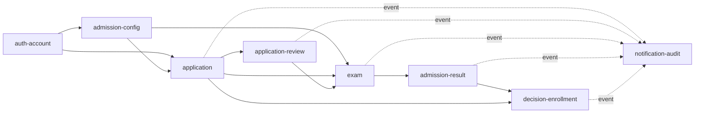

Mũi tên nét liền = gọi service trực tiếp (đồng bộ). Mũi tên nét đứt vào M8 = bắn **domain event** (`ApplicationStatusChangedEvent`, `ResultPublishedEvent`, ...) qua EventEmitter nội bộ của NestJS, để M8 tự log/audit/notify mà không làm nghẽn luồng nghiệp vụ chính.

---

## 2. Chi tiết module & Class Diagram

> Quy ước: các Class Diagram dưới đây thể hiện tầng **Domain Entity** (map 1-1 với bảng ERD) + tầng **Service** (business logic). Repository/Prisma layer không vẽ lại vì trùng ERD.

### 2.1 Module M1 — `auth-account` (Lê Phước Hào)

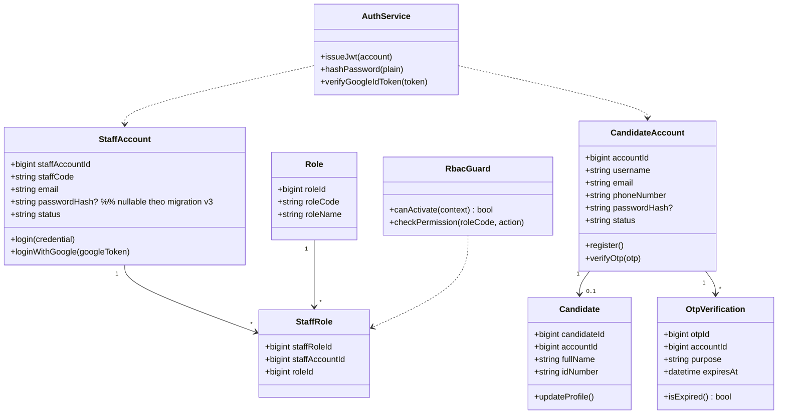

**Business rule / thuật toán chính:**
- **Đăng nhập kép (dual login):** `passwordHash` là `nullable` (đúng migration v3 — hàng 1). Logic: nếu tài khoản có `passwordHash = NULL` → chỉ cho phép `loginWithGoogle()`, chặn `login()` bằng mật khẩu và trả lỗi rõ ràng `ERR_PASSWORD_LOGIN_DISABLED` thay vì lỗi sai mật khẩu chung chung.
- **RBAC không có bảng `permission` chi tiết** (migration v3 — hàng 4, cố tình không thêm bảng): quyền hạn chi tiết theo `role_code` được khai báo **bằng code** dưới dạng ma trận hằng số (`PERMISSION_MATRIX: Record<roleCode, string[]>`) và enforce bằng `RbacGuard` (decorator `@RequirePermission('application:review')`). Nhóm QA sẽ kiểm thử dựa trên ma trận này, không dựa trên schema DB.
- **OTP**: mỗi purpose (`REGISTER`, `RESET_PASSWORD`) chỉ 1 OTP còn hiệu lực tại 1 thời điểm; tạo OTP mới phải vô hiệu OTP cũ cùng `accountId + purpose`.

### 2.2 Module M2 — `admission-config` (Lê Phước Hào)

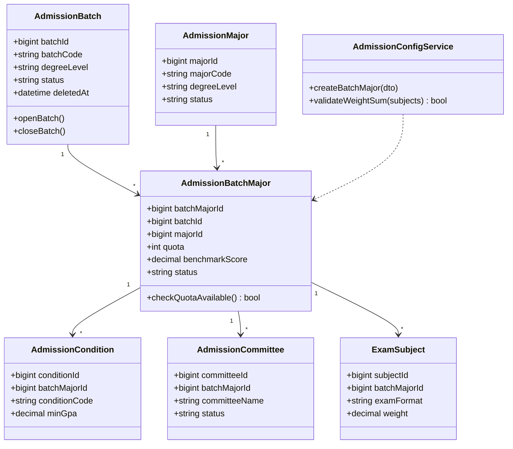

**Business rule:**
- `validateWeightSum`: tổng `weight` của các `exam_subject` thuộc cùng `batch_major_id` phải = 1.0 (100%) trước khi cho phép chuyển `admission_batch.status` sang `OPEN`.
- `admission_batch` dùng **soft delete** (`deleted_at`) — mọi query list phải filter `deleted_at IS NULL`; đây là điểm QA cần test kỹ vì dễ sót khi viết Prisma query.

### 2.3 Module M3 — `application` (Phạm Lư Gia Quân)

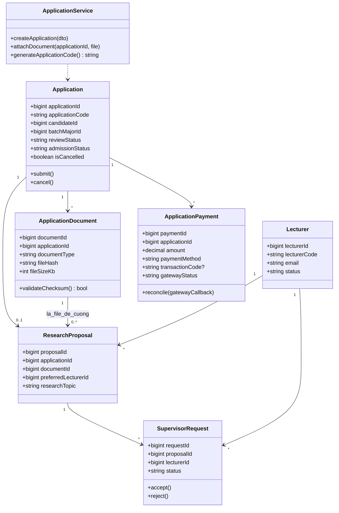

**Business rule / thuật toán chính:**
- **Sinh `application_code`**: format `<batch_code>-<major_code>-<sequence 5 số>`, sequence tăng dần theo `batch_major_id`, dùng transaction + `SELECT ... FOR UPDATE` để tránh trùng mã khi nhiều thí sinh nộp cùng lúc.
- **`transaction_code` UNIQUE cho phép nhiều NULL** (migration v3 — hàng 6): đây là hành vi chuẩn của MySQL/MariaDB (UNIQUE index bỏ qua NULL). Backend **không cần xử lý gì thêm ở code**, chỉ cần đảm bảo service không tự ý gán chuỗi rỗng `''` thay cho `NULL` (rỗng sẽ vi phạm UNIQUE ngay ở bản ghi thứ 2). Đây là điểm phải note rõ cho QA để không báo nhầm là bug.
- **Validate hồ sơ NCS**: `research_proposal` chỉ được tạo khi `admission_batch_major.degree_level = 'THAC_SI_NCS'` (hoặc tương đương) — kiểm tra chéo với M2.
- **`attachDocument`**: kiểm tra `file_hash` (SHA-256) trùng với minh chứng đã nộp trước đó trong cùng `application_id` → cảnh báo nộp trùng file, không chặn cứng (thí sinh có thể cố ý nộp lại).

### 2.4 Module M4 — `application-review` (Phạm Lư Gia Quân)

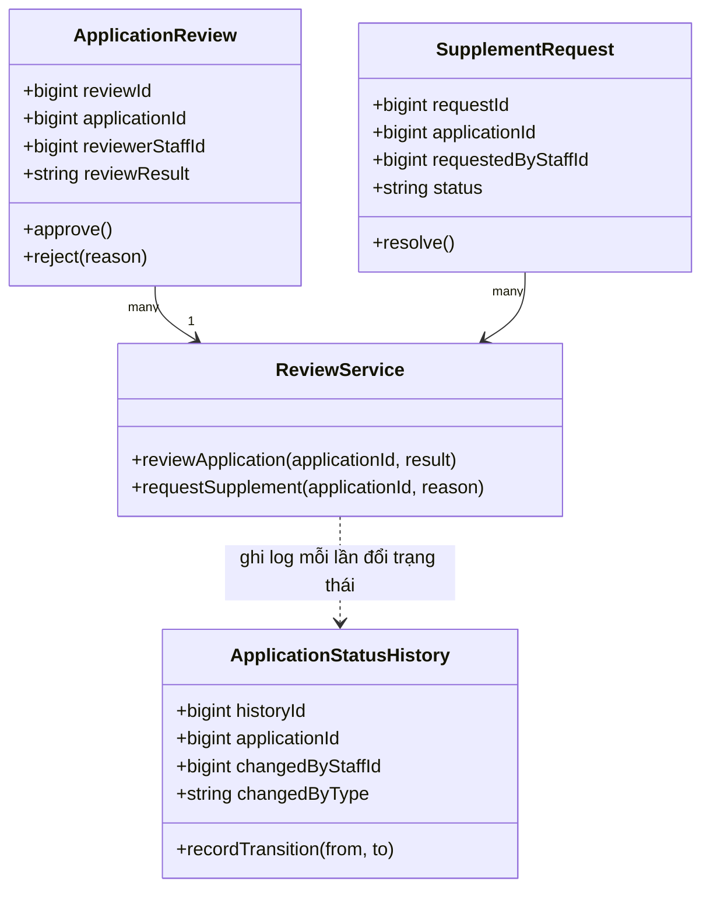

**Business rule — State Machine `application.review_status`** (thuật toán trọng tâm của module):

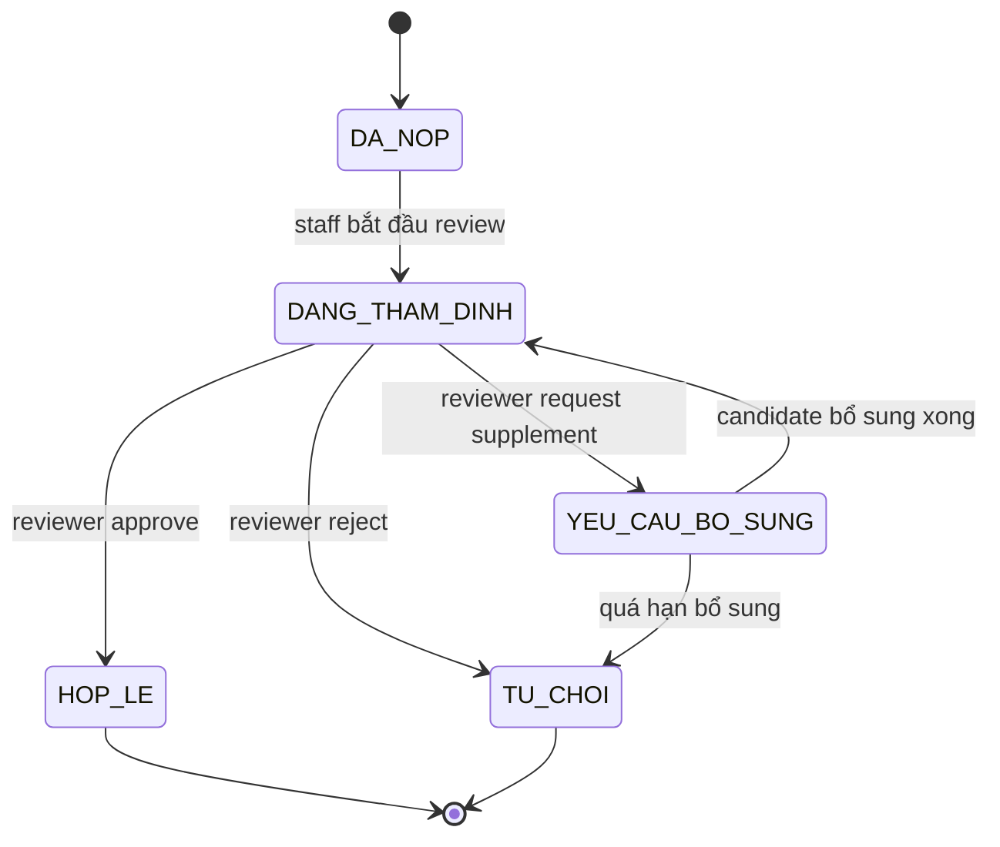

Mọi transition **bắt buộc** đi qua `ReviewService` (không cho phép update trực tiếp field `review_status` ở tầng khác) và **luôn ghi 1 dòng vào `application_status_history`** — đây là điểm liên kết trực tiếp với module Audit (M8) để đảm bảo truy vết đầy đủ, đáp ứng yêu cầu của QA/Security.

### 2.5 Module M5 — `exam` (Phan Minh Trí)

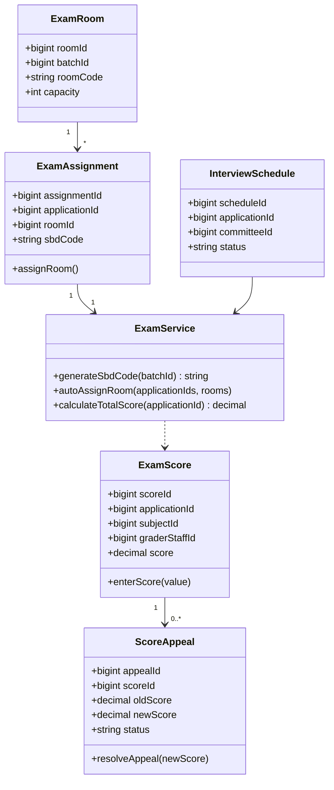

**Thuật toán chính:**
- **`autoAssignRoom`**: bin-packing đơn giản — sắp thí sinh vào phòng theo thứ tự `application_code`, mỗi phòng lấp đầy đến `capacity` rồi mới sang phòng kế; đảm bảo *idempotent* (chạy lại không tạo trùng `exam_assignment`).
- **`calculateTotalScore`**: tổng có trọng số = `Σ (exam_score.score × exam_subject.weight)` theo đúng `weight` đã validate ở M2 (tổng = 1.0).
- **Phúc khảo (`score_appeal`)**: khi `resolveAppeal` cập nhật `new_score`, phải bắn event để M6 (admission-result) tính lại `application_ranking` liên quan — **không** cho phép sửa trực tiếp `exam_score.score` sau khi đã có bản ghi phúc khảo (giữ lịch sử `old_score`/`new_score`).

### 2.6 Module M6 — `admission-result` (Phan Minh Trí)

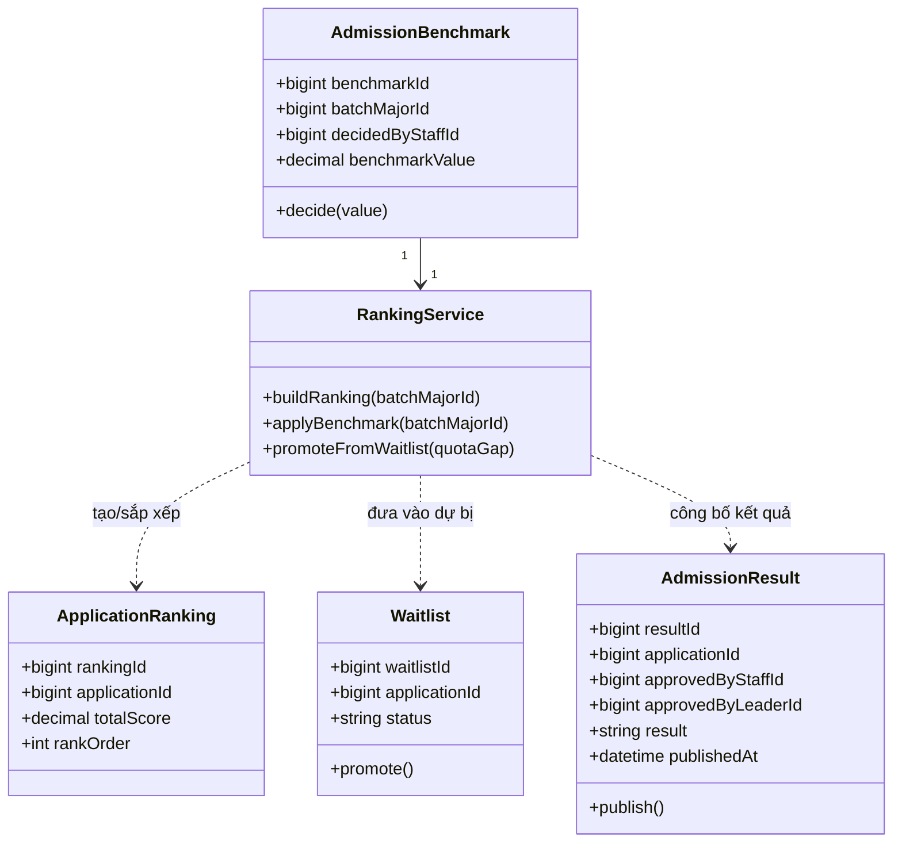

**Thuật toán trọng tâm (đây là phần nghiệp vụ phức tạp nhất, cần review kỹ với Team Lead):**

1. `buildRanking(batchMajorId)`: lấy toàn bộ `application` hợp lệ (đã thi/phỏng vấn xong) thuộc `batch_major_id`, sắp xếp theo `totalScore DESC`, gán `rank_order` tuần tự; **xử lý đồng điểm (tie-break)** theo tiêu chí phụ đã thống nhất với Team Lead (ví dụ: ưu tiên điểm chuyên môn cao hơn → thời điểm nộp hồ sơ sớm hơn).
2. `applyBenchmark(batchMajorId)`: so `total_score` với `admission_benchmark.benchmark_value`:
   - `total_score ≥ benchmark_value` **và** còn trong `quota` (theo `rank_order`) → `admission_result.result = 'TRUNG_TUYEN'`.
   - `total_score ≥ benchmark_value` nhưng **vượt quota** → đưa vào `waitlist` (`status = 'CHO_XET'`).
   - `total_score < benchmark_value` → `admission_result.result = 'KHONG_TRUNG_TUYEN'`.
3. `promoteFromWaitlist(quotaGap)`: khi có thí sinh trúng tuyển hủy nhập học (`enrollment_confirmation` bị hủy), tính `quotaGap` rồi lấy đúng số lượng thí sinh đầu danh sách `waitlist` (theo `rank_order`) để `promote()` → phát sinh `admission_result` mới. Toàn bộ thao tác nằm trong 1 transaction để tránh promote dư quota khi 2 request chạy đồng thời.
4. Toàn bộ 3 hàm trên chỉ được gọi bởi **staff có role `HOI_DONG_TUYEN_SINH` hoặc `LANH_DAO`**, và `publish()` bắt buộc có đủ 2 chữ ký `approved_by_staff_id` + `approved_by_leader_id` trước khi set `published_at` — đúng quy trình xét duyệt 2 cấp trong ERD.

### 2.7 Module M7 — `decision-enrollment` (Phan Minh Trí)

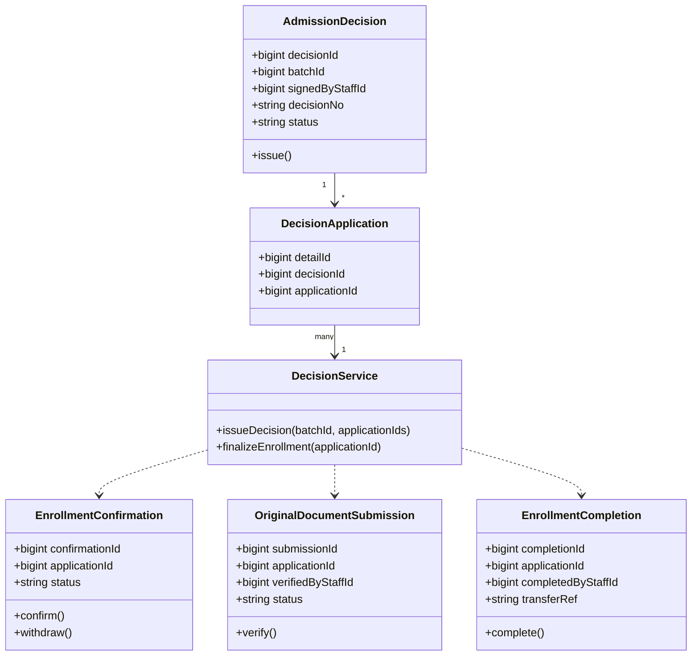

**Business rule:**
- `issueDecision`: chỉ nhận `application` có `admission_result.result = 'TRUNG_TUYEN'` **và** chưa thuộc `decision_application` nào khác (tránh 1 hồ sơ nằm trong 2 quyết định).
- `withdraw()` (thí sinh hủy nhập học sau khi đã confirm) **phải** bắn event `EnrollmentWithdrawnEvent` để M6 chạy `promoteFromWaitlist` — đây là điểm tích hợp quan trọng giữa M6 và M7, cần 2 bạn Trí tự khớp trong cùng module không phát sinh vấn đề liên module.
- `finalizeEnrollment`: chỉ chạy sau khi `original_document_submission.status = 'DA_XAC_MINH'`, sinh `transfer_ref` để bàn giao dữ liệu sinh viên sang hệ thống đào tạo (ngoài phạm vi đồ án, chỉ cần sinh mã tham chiếu).

### 2.8 Module M8 — `notification-audit` (dùng chung, 3 dev cùng review)

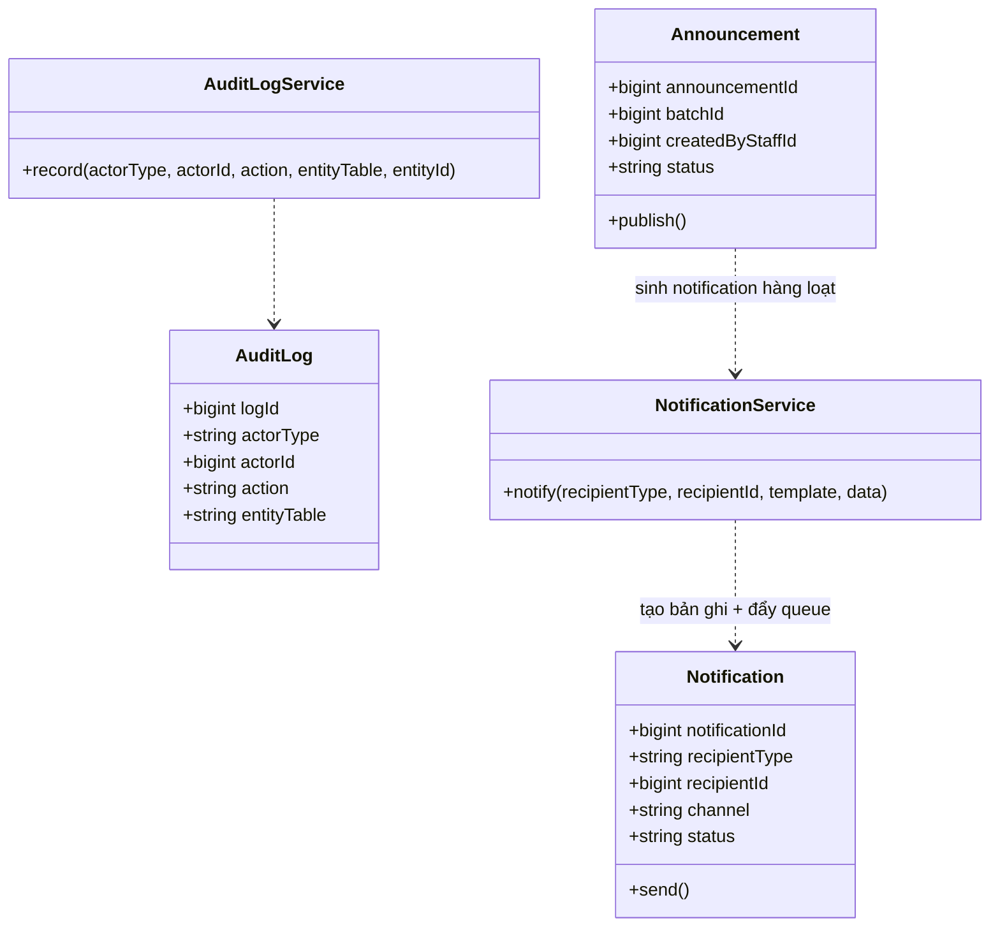

**Business rule (giải quyết đúng migration v3 — hàng 2, polymorphic FK):**
- `notification.recipient_id` và `audit_log.actor_id` **không có FK vật lý** trong DB (thiết kế polymorphic có chủ đích). Toàn vẹn dữ liệu được đảm bảo **ở tầng ứng dụng**:
  - `NotificationService.notify()` bắt buộc validate `recipientType ∈ {'CANDIDATE','STAFF'}` rồi tự query đúng bảng (`candidate_account` hoặc `staff_account`) để xác nhận `recipientId` tồn tại **trước khi** insert — dùng **Prisma middleware** (`$use`) chặn ở tầng client, đúng như comment trong migration.
  - `AuditLogService.record()` áp dụng cùng cơ chế cho `actor_type ∈ {'CANDIDATE','STAFF','SYSTEM'}`.
- `idx_audit_created_at` (migration v3 — hàng 5) đã được tạo sẵn ở DB → Backend cần đảm bảo mọi query lấy log theo khoảng thời gian **dùng đúng cột `created_at`** trong `WHERE`/`ORDER BY` để tận dụng index này (tránh full scan khi audit log phình to).

---

## 3. Sequence Diagram — các luồng nghiệp vụ lõi

### 3.1 Luồng nộp hồ sơ (Candidate nộp hồ sơ + minh chứng)

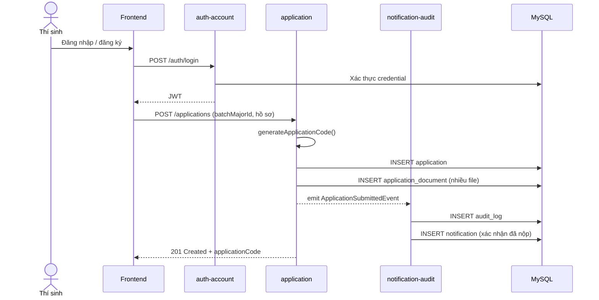

### 3.2 Luồng thẩm định hồ sơ (Staff review)

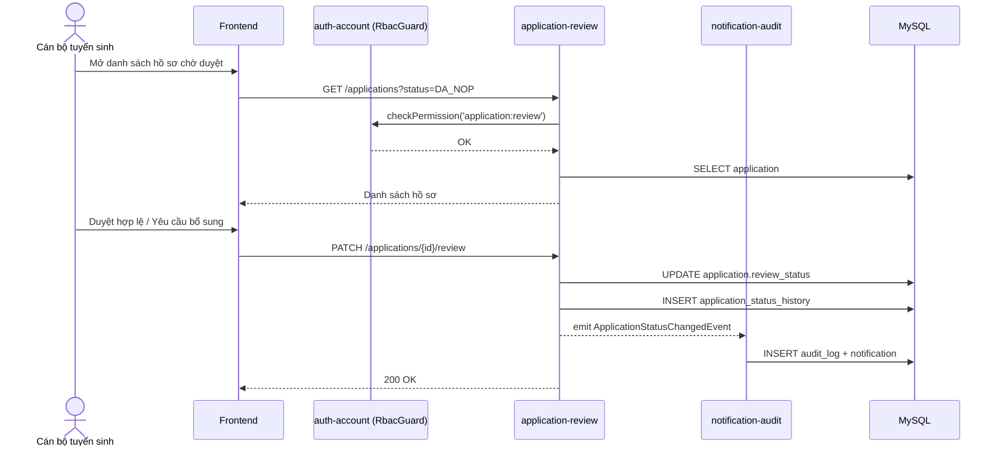

### 3.3 Luồng chấm điểm & phúc khảo

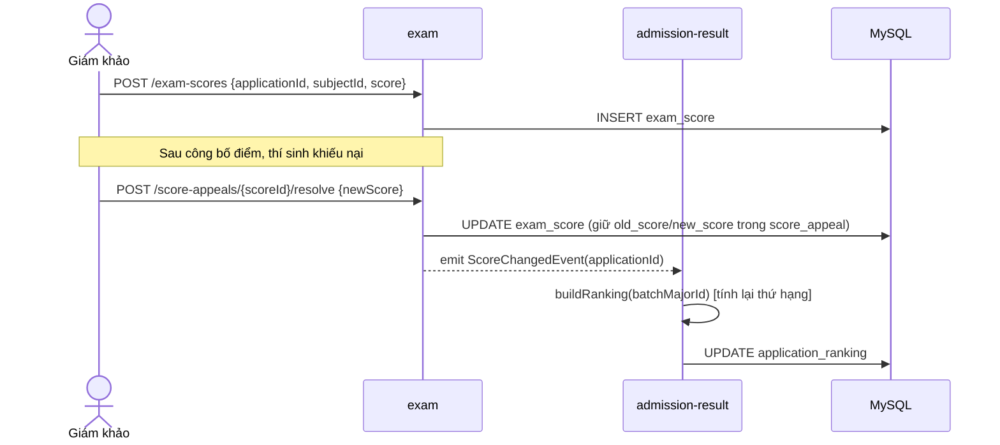

### 3.4 Luồng xét trúng tuyển & công bố kết quả

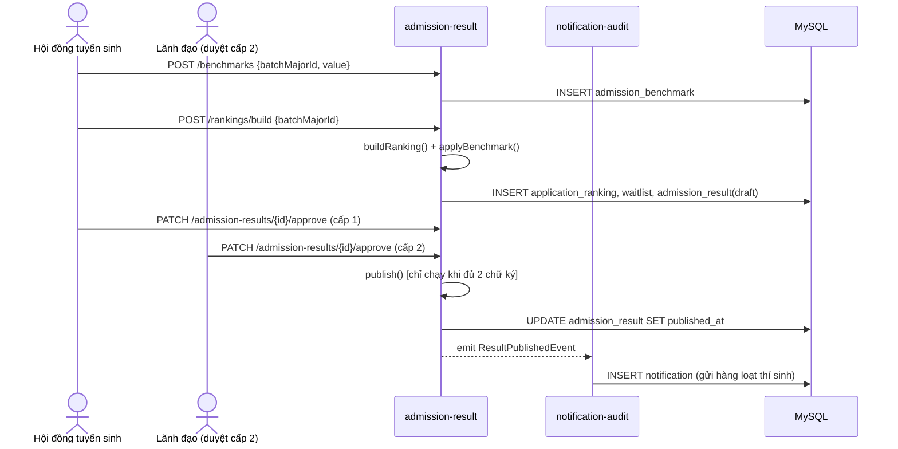

### 3.5 Luồng hủy nhập học → thăng dự bị (waitlist promotion)

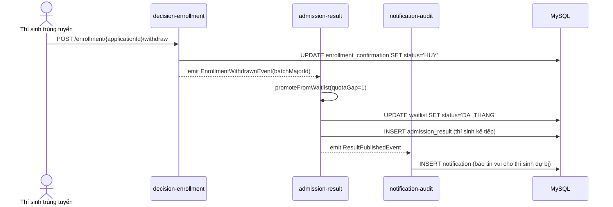

---

## 4. Đối chiếu liên nhóm (Cross-team Alignment Matrix)

Đây là phần **bắt buộc rà lại trong buổi họp GĐ3** để tài liệu Backend khớp với đầu ra các nhóm khác, tránh mỗi nhóm hiểu một kiểu:

| Nhóm | Đầu ra của họ mà Backend phụ thuộc | Đầu ra của Backend mà họ phụ thuộc | Điểm cần đối chiếu |
|---|---|---|---|
| **Team Lead** (Thái Hoàng Minh) | DDD tổng hợp GĐ3 | Nội dung mục 1–4 của tài liệu này để gộp vào DDD | Tên module, mã nghiệp vụ (`TRUNG_TUYEN`, `CHO_XET`...) phải **thống nhất thuật ngữ** trong toàn bộ DDD, không để mỗi phần dùng 1 tên khác nhau. |
| **QA / Security & Data** (Lâm Hoài An) | ERD v3, `migration_v3_GD3.sql` | Danh sách API + validation rule (mục 2, 5) để viết test case | Đối chiếu **6 hàng migration v3** — mục 2.1, 2.2, 2.3, 2.8 của tài liệu này đã xử lý đủ cả 6 hàng chưa (đã tick ở mục 5.3). RBAC không có bảng permission → QA test theo ma trận code, không test theo schema. |
| **Frontend / Mobile** (Châu Minh Tuệ, Nguyễn Phúc Khang) | Wireframe, Design System | API contract rút gọn (mục 6), state machine (mục 2.4) để render đúng trạng thái/nút bấm | Tên trạng thái hiển thị trên UI (`Đã nộp`, `Đang thẩm định`...) phải map đúng 1-1 với `enum` backend trả về, tránh FE tự đặt tên khác. |
| **DevOps / Cloud** (Võ Trường Hải, Nguyễn Thành Luân) | Docker Compose, CI/CD, cấu hình logging/monitoring | Danh sách biến môi trường, endpoint `/health`, format log chuẩn | Backend cam kết expose `GET /health` (đã có healthcheck ở docker-compose theo PR #5) và log JSON có `traceId` để DevOps gắn vào hệ thống monitoring. Biến môi trường cần: `DATABASE_URL`, `JWT_SECRET`, `GOOGLE_CLIENT_ID`, `OTP_TTL_SECONDS`. |

---

## 5. Danh sách API chính (rút gọn cho Frontend bám vào)

| Method | Endpoint | Module | Mô tả |
|---|---|---|---|
| POST | `/auth/login` | M1 | Đăng nhập bằng mật khẩu (nếu có) |
| POST | `/auth/google` | M1 | Đăng nhập bằng Google |
| POST | `/candidates/register` | M1 | Đăng ký tài khoản thí sinh + gửi OTP |
| GET | `/admission-batches` | M2 | Danh sách đợt tuyển sinh đang mở |
| POST | `/applications` | M3 | Nộp hồ sơ mới |
| POST | `/applications/{id}/documents` | M3 | Đính kèm minh chứng |
| GET | `/applications/{id}` | M3/M4 | Xem chi tiết hồ sơ + trạng thái |
| PATCH | `/applications/{id}/review` | M4 | Cán bộ duyệt/yêu cầu bổ sung |
| POST | `/exam-assignments/auto-assign` | M5 | Xếp phòng thi tự động |
| POST | `/exam-scores` | M5 | Nhập điểm |
| POST | `/score-appeals/{scoreId}/resolve` | M5 | Xử lý phúc khảo |
| POST | `/rankings/build` | M6 | Tính xếp hạng theo điểm chuẩn |
| PATCH | `/admission-results/{id}/approve` | M6 | Duyệt kết quả (2 cấp) |
| POST | `/decisions` | M7 | Ban hành quyết định trúng tuyển |
| POST | `/enrollment/{id}/confirm` | M7 | Xác nhận nhập học |
| POST | `/enrollment/{id}/withdraw` | M7 | Hủy nhập học (kích hoạt thăng dự bị) |
| GET | `/health` | — | Healthcheck cho DevOps |

---

## 6. Checklist hoàn thành GĐ3 — nhóm Backend (Definition of Done)

- [ ] Class Diagram của cả 8 module đã review chéo giữa 3 thành viên (không chỉ tự vẽ module của mình).
- [ ] Sequence Diagram của 5 luồng lõi đã đối chiếu với Frontend để khớp state hiển thị UI.
- [ ] Đã xử lý/ghi chú đủ **6 hàng quyết định** trong `migration_v3_GD3.sql`:
  - Hàng 1 (password_hash nullable) → mục 2.1 ✅
  - Hàng 2 (polymorphic FK) → mục 2.8 ✅
  - Hàng 3 (sửa số trigger trong tài liệu, không phải code) → thông báo cho Team Lead cập nhật DDD, Backend không cần đổi code.
  - Hàng 4 (không thêm bảng permission) → mục 2.1 ✅
  - Hàng 5 (index audit_log) → mục 2.8 ✅
  - Hàng 6 (transaction_code UNIQUE cho phép nhiều NULL) → mục 2.3 ✅
- [ ] Danh sách API (mục 5) đã gửi cho Frontend và DevOps xác nhận.
- [ ] Ma trận phân quyền RBAC (code, không phải bảng DB) đã bàn giao cho QA để viết test case.
- [ ] Thuật toán xếp hạng/điểm chuẩn/waitlist (mục 2.6) đã được Team Lead + đại diện nghiệp vụ (giảng viên hướng dẫn/đề bài) xác nhận đúng quy chế tuyển sinh thực tế trước khi code.
