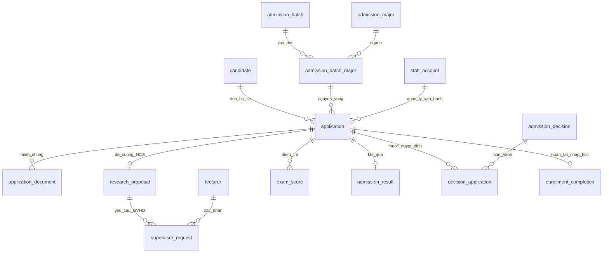

# ERD — Phân hệ Quản lý Tuyển sinh Sau đại học (Giai đoạn 3)

| Mục | Nội dung |
|---|---|
| Người thực hiện | Lâm Hoài An — QA / Security & Data Specialist |
| Nguồn dữ liệu | `admission_db.sql` (v2, 40 bảng / 10 miền nghiệp vụ, 11 trigger, 1 stored procedure) |
| Tài liệu liên quan | Thiết kế CSDL Phân hệ Tuyển sinh (GĐ2), HLD (GĐ2) |

## 0. Chú giải ký hiệu quan hệ (Mermaid crow's foot)

| Ký hiệu | Ý nghĩa |
|---|---|
| `\|\|` | Đúng 1 (exactly one) |
| `o\|` | 0 hoặc 1 (zero or one) |
| `o{` | 0 hoặc nhiều (zero or many) |
| `\|{` | 1 hoặc nhiều (one or many) |

Ví dụ: `application \|\|--o{ application_document` = **1 hồ sơ có 0-nhiều minh chứng**.
Cột đánh dấu `PK` = khóa chính, `FK` = khóa ngoại, `UK` = ràng buộc UNIQUE.

---

## 1. ERD tổng thể (đầy đủ 40 bảng, đúng theo `admission_db.sql`)

```mermaid
erDiagram
    %% ===== MIỀN 1: DANH MỤC & CẤU HÌNH ĐỢT TUYỂN SINH =====
    admission_batch {
        bigint batch_id PK
        string batch_code UK
        string degree_level
        string status
        datetime deleted_at
    }
    admission_major {
        bigint major_id PK
        string major_code UK
        string degree_level
        string status
    }
    admission_batch_major {
        bigint batch_major_id PK
        bigint batch_id FK
        bigint major_id FK
        int quota
        decimal benchmark_score
        string status
    }
    admission_condition {
        bigint condition_id PK
        bigint batch_major_id FK
        string condition_code
        decimal min_gpa
    }
    admission_committee {
        bigint committee_id PK
        bigint batch_major_id FK
        string committee_name
        string status
    }
    committee_member {
        bigint member_id PK
        bigint committee_id FK
        string role_in_committee
    }
    exam_subject {
        bigint subject_id PK
        bigint batch_major_id FK
        string exam_format
        decimal weight
    }

    %% ===== MIỀN 2: NGƯỜI DÙNG NỘI BỘ & PHÂN QUYỀN (dùng chung) =====
    staff_account {
        bigint staff_account_id PK
        string staff_code UK
        string email UK
        string password_hash
        string status
    }
    role {
        bigint role_id PK
        string role_code UK
        string role_name
    }
    staff_role {
        bigint staff_role_id PK
        bigint staff_account_id FK
        bigint role_id FK
    }
    system_config {
        string config_key PK
        string config_value
    }

    %% ===== MIỀN 3: TÀI KHOẢN & HỒ SƠ CÁ NHÂN THÍ SINH =====
    candidate_account {
        bigint account_id PK
        string username UK
        string email UK
        string phone_number UK
        string password_hash
        string status
    }
    otp_verification {
        bigint otp_id PK
        bigint account_id FK
        string purpose
        datetime expires_at
    }
    candidate {
        bigint candidate_id PK
        bigint account_id FK
        string full_name
        string id_number UK
    }

    %% ===== MIỀN 4: HỒ SƠ, MINH CHỨNG, LỆ PHÍ & NCS =====
    application {
        bigint application_id PK
        string application_code UK
        bigint candidate_id FK
        bigint batch_major_id FK
        string review_status
        string admission_status
        boolean is_cancelled
    }
    application_document {
        bigint document_id PK
        bigint application_id FK
        string document_type
        string file_hash
        int file_size_kb
    }
    lecturer {
        bigint lecturer_id PK
        string lecturer_code UK
        string email UK
        string status
    }
    research_proposal {
        bigint proposal_id PK
        bigint application_id FK
        bigint document_id FK
        bigint preferred_lecturer_id FK
        string research_topic
    }
    supervisor_request {
        bigint request_id PK
        bigint proposal_id FK
        bigint lecturer_id FK
        string status
    }
    application_payment {
        bigint payment_id PK
        bigint application_id FK
        decimal amount
        string payment_method
        string transaction_code UK
        string gateway_status
    }

    %% ===== MIỀN 5: THẨM ĐỊNH & LỊCH SỬ TRẠNG THÁI =====
    application_review {
        bigint review_id PK
        bigint application_id FK
        bigint reviewer_staff_id FK
        string review_result
    }
    supplement_request {
        bigint request_id PK
        bigint application_id FK
        bigint requested_by_staff_id FK
        string status
    }
    application_status_history {
        bigint history_id PK
        bigint application_id FK
        bigint changed_by_staff_id FK
        string changed_by_type
    }

    %% ===== MIỀN 6: TỔ CHỨC XÉT TUYỂN / THI =====
    exam_room {
        bigint room_id PK
        bigint batch_id FK
        string room_code
        int capacity
    }
    exam_assignment {
        bigint assignment_id PK
        bigint application_id FK
        bigint room_id FK
        string sbd_code UK
    }
    interview_schedule {
        bigint schedule_id PK
        bigint application_id FK
        bigint committee_id FK
        string status
    }
    exam_score {
        bigint score_id PK
        bigint application_id FK
        bigint subject_id FK
        bigint grader_staff_id FK
        decimal score
    }
    score_appeal {
        bigint appeal_id PK
        bigint score_id FK
        decimal old_score
        decimal new_score
        string status
    }

    %% ===== MIỀN 7: XÉT TRÚNG TUYỂN =====
    admission_benchmark {
        bigint benchmark_id PK
        bigint batch_major_id FK
        bigint decided_by_staff_id FK
        decimal benchmark_value
    }
    application_ranking {
        bigint ranking_id PK
        bigint application_id FK
        decimal total_score
        int rank_order
    }
    waitlist {
        bigint waitlist_id PK
        bigint application_id FK
        string status
    }
    admission_result {
        bigint result_id PK
        bigint application_id FK
        bigint approved_by_staff_id FK
        bigint approved_by_leader_id FK
        string result
        datetime published_at
    }

    %% ===== MIỀN 8: RA QUYẾT ĐỊNH & NHẬP HỌC =====
    admission_decision {
        bigint decision_id PK
        bigint batch_id FK
        bigint signed_by_staff_id FK
        string decision_no UK
        string status
    }
    decision_application {
        bigint detail_id PK
        bigint decision_id FK
        bigint application_id FK
    }
    enrollment_confirmation {
        bigint confirmation_id PK
        bigint application_id FK
        string status
    }
    original_document_submission {
        bigint submission_id PK
        bigint application_id FK
        bigint verified_by_staff_id FK
        string status
    }
    enrollment_completion {
        bigint completion_id PK
        bigint application_id FK
        bigint completed_by_staff_id FK
        string transfer_ref
    }

    %% ===== MIỀN 9: THÔNG BÁO & CÔNG BỐ =====
    announcement {
        bigint announcement_id PK
        bigint batch_id FK
        bigint created_by_staff_id FK
        string status
    }
    notification {
        bigint notification_id PK
        string recipient_type
        bigint recipient_id
        string channel
        string status
    }

    %% ===== MIỀN 10: NHẬT KÝ HỆ THỐNG =====
    audit_log {
        bigint log_id PK
        string actor_type
        bigint actor_id
        string action
        string entity_table
    }

    %% ================= QUAN HỆ =================
    admission_batch ||--o{ admission_batch_major : mo_dot
    admission_major ||--o{ admission_batch_major : thuoc_nganh
    admission_batch_major ||--o{ admission_condition : quy_dinh_dieu_kien
    admission_batch_major ||--o{ admission_committee : co_hoi_dong
    admission_committee ||--o{ committee_member : gom_thanh_vien
    admission_batch_major ||--o{ exam_subject : quy_dinh_mon_thi

    staff_account ||--o{ staff_role : duoc_gan
    role ||--o{ staff_role : ap_dung_cho

    candidate_account ||--o{ otp_verification : xac_thuc
    candidate_account ||--o| candidate : co_ho_so

    candidate ||--o{ application : nop_ho_so
    admission_batch_major ||--o{ application : la_nguyen_vong

    application ||--o{ application_document : dinh_kem_minh_chung
    application ||--o| research_proposal : co_de_cuong
    application_document ||--o{ research_proposal : la_file_de_cuong
    lecturer ||--o{ research_proposal : duoc_de_xuat
    research_proposal ||--o{ supervisor_request : gui_yeu_cau
    lecturer ||--o{ supervisor_request : nhan_yeu_cau
    application ||--o{ application_payment : thanh_toan

    application ||--o{ application_review : duoc_tham_dinh
    staff_account ||--o{ application_review : tham_dinh
    application ||--o{ supplement_request : bi_yeu_cau_bo_sung
    staff_account ||--o{ supplement_request : yeu_cau
    application ||--o{ application_status_history : co_lich_su
    staff_account ||--o{ application_status_history : thay_doi_boi

    admission_batch ||--o{ exam_room : bo_tri
    exam_room ||--o{ exam_assignment : xep_phong
    application ||--o| exam_assignment : co_so_bao_danh
    application ||--o{ interview_schedule : co_lich_pv
    admission_committee ||--o{ interview_schedule : to_chuc
    application ||--o{ exam_score : co_diem
    exam_subject ||--o{ exam_score : theo_mon
    staff_account ||--o{ exam_score : cham_diem
    exam_score ||--o{ score_appeal : duoc_phuc_khao

    admission_batch_major ||--o| admission_benchmark : co_diem_chuan
    staff_account ||--o{ admission_benchmark : quyet_dinh
    application ||--o| application_ranking : duoc_xep_hang
    application ||--o| waitlist : vao_du_bi
    application ||--o| admission_result : co_ket_qua
    staff_account ||--o{ admission_result : duyet_ket_qua

    admission_batch ||--o{ admission_decision : ban_hanh
    staff_account ||--o{ admission_decision : ky_so
    admission_decision ||--o{ decision_application : gom_ho_so
    application ||--o{ decision_application : thuoc_quyet_dinh
    application ||--o| enrollment_confirmation : xac_nhan_nhap_hoc
    application ||--o| original_document_submission : nop_ban_chinh
    staff_account ||--o{ original_document_submission : xac_minh
    application ||--o| enrollment_completion : hoan_tat
    staff_account ||--o{ enrollment_completion : thuc_hien

    admission_batch ||--o{ announcement : cong_bo
    staff_account ||--o{ announcement : tao
```

---

## 2. ERD rút gọn — luồng nghiệp vụ cốt lõi (dùng thuyết trình / họp nhóm)

Chỉ giữ lại các thực thể trung tâm, bỏ bảng danh mục phụ và bảng log, để nhìn nhanh vòng đời một hồ sơ.

---

## 3. Danh sách 40 bảng theo 10 miền nghiệp vụ (tổng hợp nhanh)

| Miền | Bảng |
|---|---|
| 1. Danh mục & cấu hình đợt | admission_batch, admission_major, admission_batch_major, admission_condition, admission_committee, committee_member, exam_subject |
| 2. Người dùng nội bộ & RBAC | staff_account, role, staff_role, system_config |
| 3. Tài khoản & hồ sơ thí sinh | candidate_account, otp_verification, candidate |
| 4. Hồ sơ, minh chứng, lệ phí & NCS | application, application_document, lecturer, research_proposal, supervisor_request, application_payment |
| 5. Thẩm định & lịch sử | application_review, supplement_request, application_status_history |
| 6. Tổ chức xét tuyển / thi | exam_room, exam_assignment, interview_schedule, exam_score, score_appeal |
| 7. Xét trúng tuyển | admission_benchmark, application_ranking, waitlist, admission_result |
| 8. Quyết định & nhập học | admission_decision, decision_application, enrollment_confirmation, original_document_submission, enrollment_completion |
| 9. Thông báo & công bố | announcement, notification |
| 10. Nhật ký hệ thống | audit_log |

